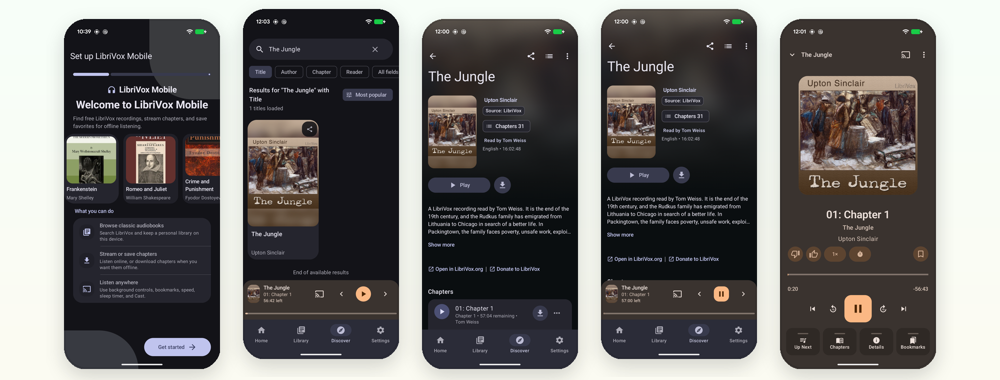
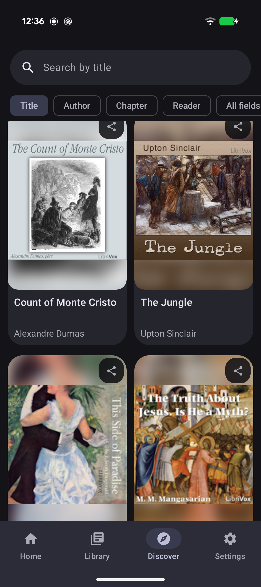
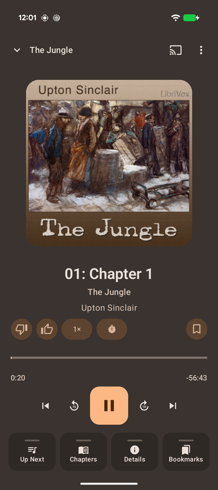

<p align="center">
  
</p>

# LibriVox Mobile

Android audiobook app for free public-domain LibriVox recordings.

## Features

- Browse and search LibriVox by title, author, chapter, or reader.
- Stream chapters or download books for offline listening.
- Keep a personal library with progress, likes, and bookmarks.
- Listen with speed, sleep timer, chapter skip, Cast, and background media controls.
- Open the original LibriVox page or donation link from each book.

## Screenshots

<p>
  
  
  
  
</p>

## Build

- Android Studio or JDK 17
- Android SDK 37
- Min Android SDK 36

```bash
./gradlew :app:assembleDebug
./gradlew :app:installDebug
```

## Website

The app website is a static GitHub Pages site in `docs/`.

```bash
npm run serve
npm run check:site
npm run build
```

`npm run serve` previews the site at `http://127.0.0.1:4173/`. Set `PORT=4174` or pass `-- --port 4174` to use a different port.

`npm run build` validates the static site. It does not generate a separate output folder because GitHub Pages serves `docs/` directly. The included GitHub Actions workflow uploads `docs/` to GitHub Pages after the check passes.

## iOS Planning

The iOS Liquid Glass port checklist lives in [docs/ios-liquid-glass-checklist.md](docs/ios-liquid-glass-checklist.md).
The stricter builder-checklist review lives in [docs/ios-builder-checklist-review.md](docs/ios-builder-checklist-review.md).

## Before Release

- Replace the sample `applicationId`.
- Add release signing.
- Publish a privacy policy.
- Verify all artwork, metadata, and audio attribution.
- Keep the app clear that it is unofficial and not affiliated with LibriVox.

## License

MIT. See [LICENSE](LICENSE).
