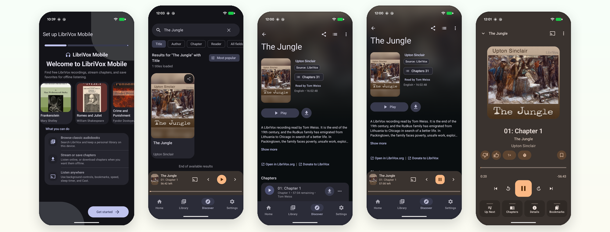
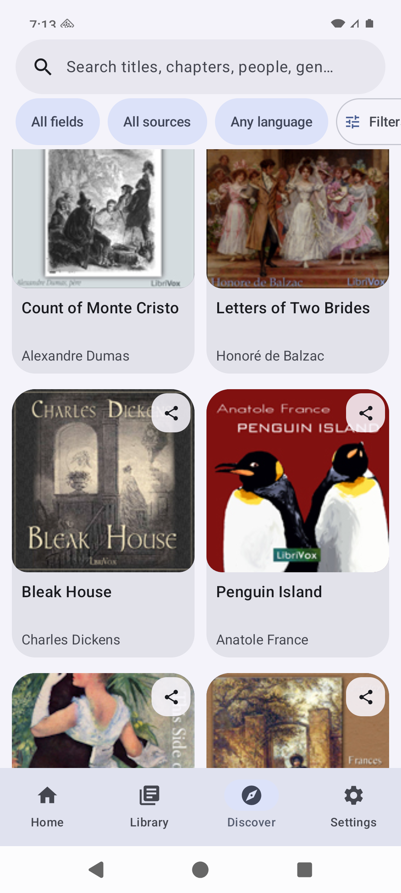
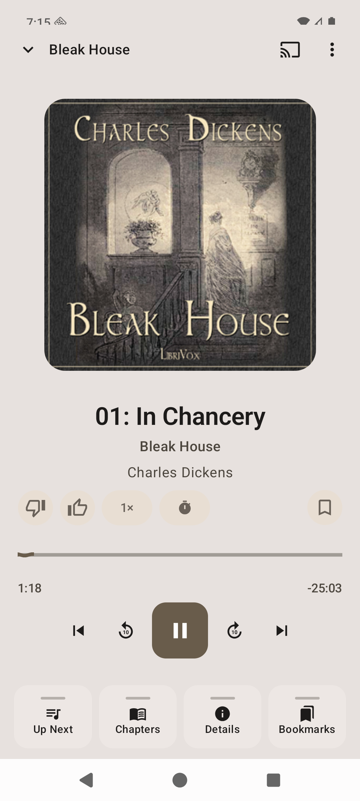
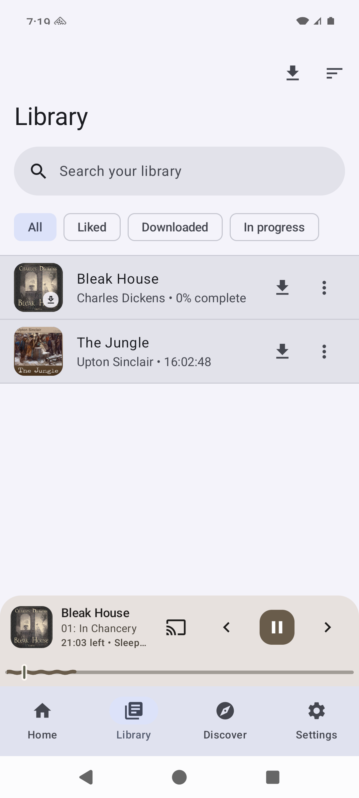
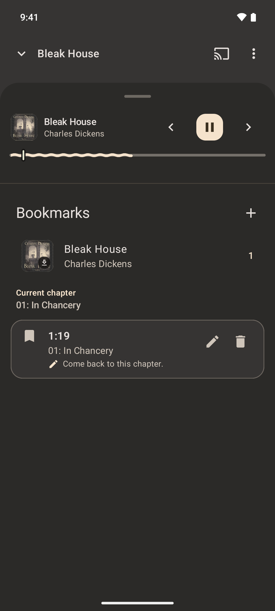
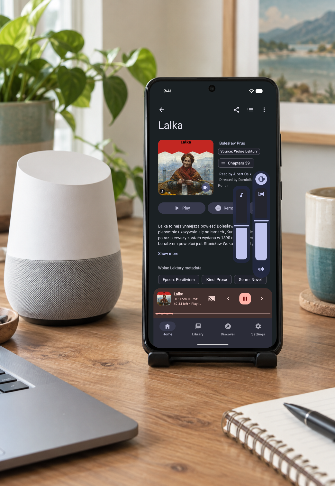
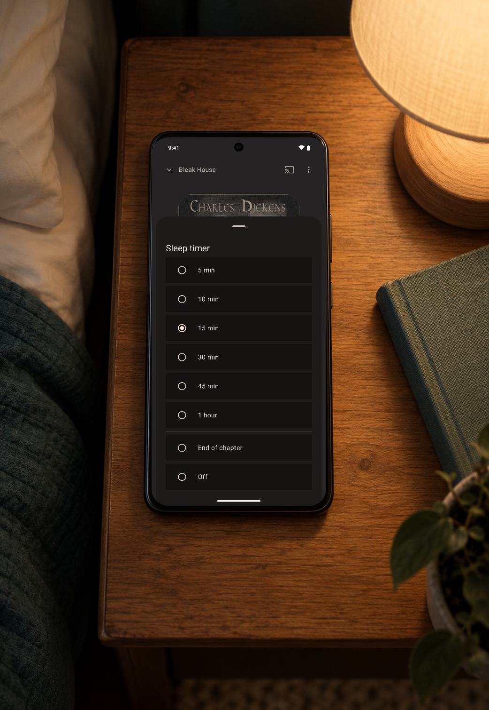

<p align="center">
  
</p>

# LibriVox Mobile

LibriVox Mobile brings audiobooks from LibriVox, Lit2Go, Project Gutenberg, and Wolne Lektury together in one app. Listen to classic novels, short stories, poetry, and nonfiction online or save chapters for offline listening.

**100% free. No ads, subscriptions, in-app purchases, or paid upgrades.** Every app feature is available without payment, and no account is required.

This is an open-source project under the [MIT license](LICENSE), built to make these public audiobook libraries easier to use. Anyone can read the code, [report a problem](https://github.com/ababilinski/librivox-mobile/issues), or contribute improvements.

[Project website](https://ababilinski.github.io/librivox-mobile/) · [Privacy policy](https://ababilinski.github.io/librivox-mobile/privacy-policy/) · [Support](https://ababilinski.github.io/librivox-mobile/support/)

## Audiobook sources

The books and recordings come from the projects below. Source information, reader credits, and original project links remain available in book details.

| Source | What it provides |
| --- | --- |
| [LibriVox](https://librivox.org/) | Public-domain books recorded by volunteers around the world. |
| [Lit2Go](https://etc.usf.edu/lit2go/) | Stories and poems from the University of South Florida's educational collection. |
| [Project Gutenberg](https://www.gutenberg.org/) | Audiobook editions from its digital library, accessed through [Gutendex](https://gutendex.com/). |
| [Wolne Lektury](https://wolnelektury.pl/) | Polish literature and audiobooks from the Wolne Lektury digital library. |

LibriVox is enabled when you start. Enable the other catalogs in Settings and choose the languages you want to browse.

LibriVox Mobile does not charge for access to these recordings. It is independent and is not affiliated with or endorsed by any of the source projects. Recordings, artwork, and catalog information retain their source licenses; the app's MIT license does not replace them. Public-domain status varies by country, so check a work's rights where you live before downloading or using it.

## Listening

- Stream chapters or download them for offline listening.
- Save books to your library and keep your listening progress, likes, and bookmarks with notes.
- Adjust playback speed, set a sleep timer, and move between chapters.
- Keep listening while using other apps, with background playback and media controls.
- Cast to compatible Google Cast speakers, TVs, and receivers on the same local network.
- Open the original source pages and available donation links to support the projects that provide the books.

## Screenshots

<p>
  
  
  
  
</p>

Cast to a compatible speaker, listen to a downloaded chapter while out, or set a timer before bed. These illustrative phone scenes use different authentic app captures from the screenshots above.

<p>
  
  
  
</p>

## Build

- Android Studio or JDK 17
- Android SDK 37
- Min Android SDK 36

```bash
./gradlew :app:assembleDebug
./gradlew :app:installDebug
```

## Website

The app website is a static GitHub Pages site in `docs/`.

```bash
npm run serve
npm run check:site
npm run build
```

`npm run serve` previews the site at `http://127.0.0.1:4173/`. Set `PORT=4174` or pass `-- --port 4174` to use a different port.

`npm run build` validates the static site. It does not generate a separate output folder because GitHub Pages serves `docs/` directly. The included GitHub Actions workflow uploads `docs/` to GitHub Pages after the check passes.

## iOS Planning

The iOS Liquid Glass port checklist lives in [docs/ios-liquid-glass-checklist.md](docs/ios-liquid-glass-checklist.md).
The stricter builder-checklist review lives in [docs/ios-builder-checklist-review.md](docs/ios-builder-checklist-review.md).

## Release checks

- Keep signing keys and credentials out of Git.
- Run the release build, unit tests, lint, and website validation.
- Check playback, downloads, offline listening, and Cast on Android.
- Keep the privacy policy and store declarations consistent with the release.
- Verify source licenses, reader credits, artwork attribution, and the independent-app disclosure.

## License

MIT. See [LICENSE](LICENSE).
